  

<picture>
  <source media="(prefers-color-scheme: dark)" srcset="assets/plate-dark.svg">
  
</picture>

  <a href="https://www.linkedin.com/in/tejas03/"><code>linkedin</code></a> &nbsp;
  <a href="mailto:tejasthange3@gmail.com"><code>email</code></a> &nbsp;
  <a href="https://github.com/TejasThange3?tab=repositories"><code>repositories</code></a>
   art: <a href="https://giphy.com/gifs/RMwgs5kZqkRyhF24KK">Seeking Blue</a> via GIPHY · the scene changes with the time of day in Pune

<picture>
  <source media="(prefers-color-scheme: dark)" srcset="assets/card-dark.svg">
  
</picture>

### Projects

| Project | What it is | Built with |
| :-- | :-- | :-- |
| **[Doc QA](https://github.com/TejasThange3/docqa)** | Multimodal RAG that answers questions over PDFs with text, tables and images, evaluated with RAGAS | LangGraph · FastAPI · Streamlit |
| **[GanScape](https://github.com/TejasThange3/GANSCAPE-3D-TERRAIN-GENERATION)** | GAN (attention U-Net + PatchGAN) that turns segmentation masks into 3D terrain height maps | PyTorch · PyVista |
| **[Pest Detection](https://github.com/TejasThange3/Pest-Detection-Using-Embedded-AI)** | Real-time YOLOv5n pest detector on a Raspberry Pi, quantized and pruned | YOLOv5n · Raspberry Pi |

### Toolkit

<picture>
  <source media="(prefers-color-scheme: dark)" srcset="assets/tech-dark.svg">
  
</picture>

### Activity

<picture>
  <source media="(prefers-color-scheme: dark)" srcset="assets/live-dark.svg">
  
</picture>
