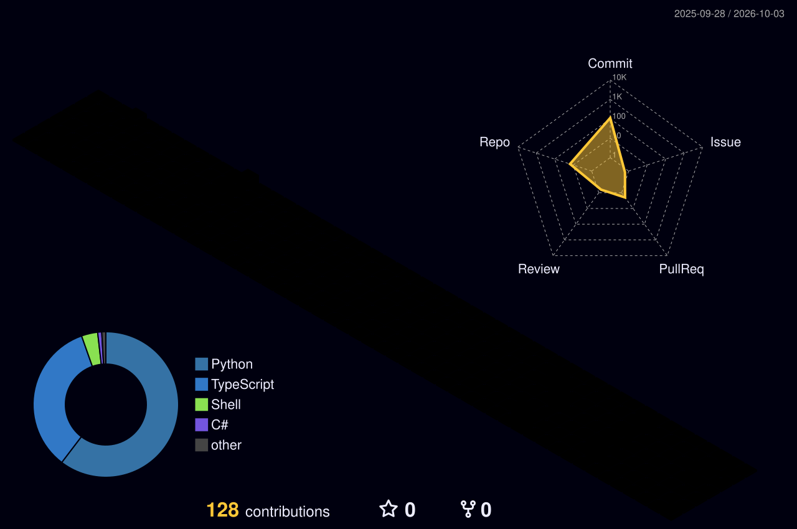

  

  
  
  

 

## 01 · About

I'm an AI/ML engineer with a B.Tech in Artificial Intelligence & Machine Learning from Symbiosis Institute of Technology, Pune. I like building applied AI systems end to end, from data and models to the backend and interface.

- **Now:** AI Programming Intern at **Mimic Productions**, porting the document ingestion part of a RAG service from Node.js to Python and building a web-scraping service that feeds it
- **Also at Mimic:** tested open-source speech-to-text and text-to-speech models for edge devices
- **Before:** Upbringing Technologies, where I built and deployed the company website on Next.js + Vercel
- **Interested in:** AI Engineer, Applied AI and Generative AI roles

 

## 02 · Featured Projects

| Project | What it does | Built with |
| --- | --- | --- |
| [**Doc QA**](https://github.com/TejasThange3/docqa) | Multimodal RAG system that answers questions over PDFs with text, tables and images, evaluated with RAGAS | LangGraph · FastAPI · Streamlit |
| [**GanScape**](https://github.com/TejasThange3/GANSCAPE-3D-TERRAIN-GENERATION) | GAN (attention U-Net + PatchGAN) that turns segmentation masks into 3D terrain height maps | PyTorch · PyVista |
| [**Pest Detection**](https://github.com/TejasThange3/Pest-Detection-Using-Embedded-AI) | Lightweight YOLOv5n pest detector running real-time on a Raspberry Pi, quantized and pruned | YOLOv5n · Raspberry Pi |

 

## 03 · Tech Stack

  
    
  

  <b>AI &amp; ML:</b> LLMs · RAG · LangGraph · Embeddings · Vector Databases · RAGAS · Computer Vision · GANs · YOLO · Whisper · ONNX Runtime
   
  <b>Also using:</b> Streamlit · Pandas · NumPy · SQL · Claude Code · Codex · Cursor · Wispr Flow

 

## 04 · Contributions in 3D

  

 

## 05 · GitHub Stats

  
  

  

 

<code>// thanks for stopping by</code>

